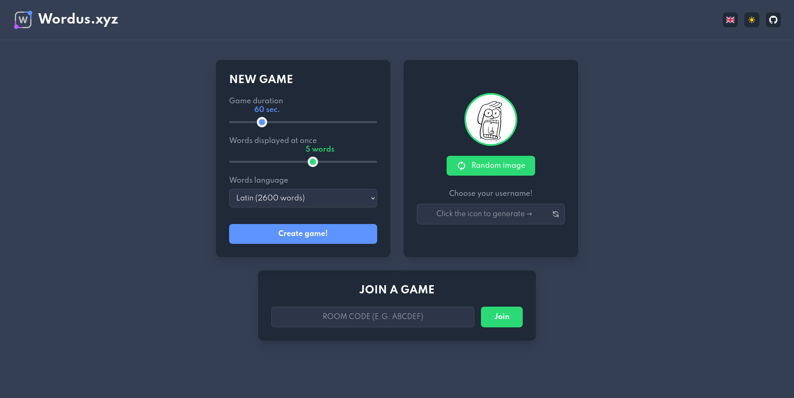
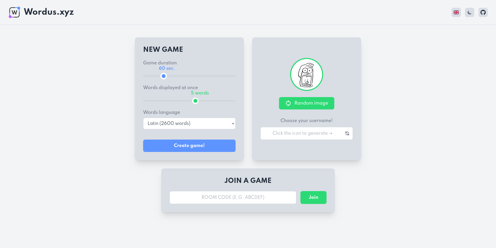
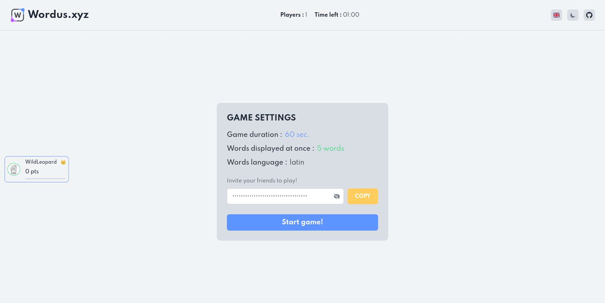
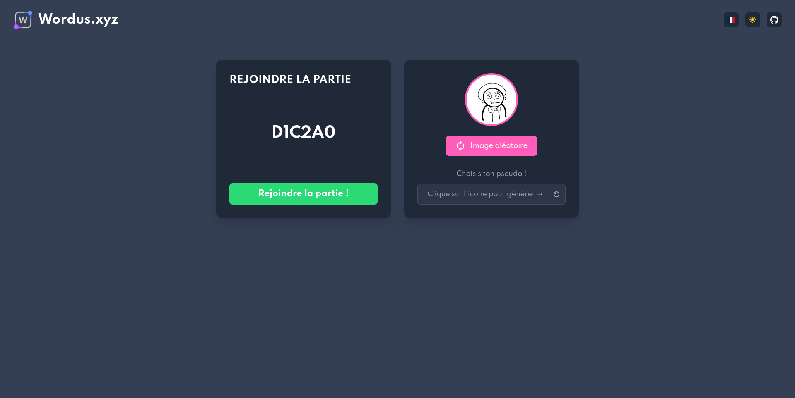
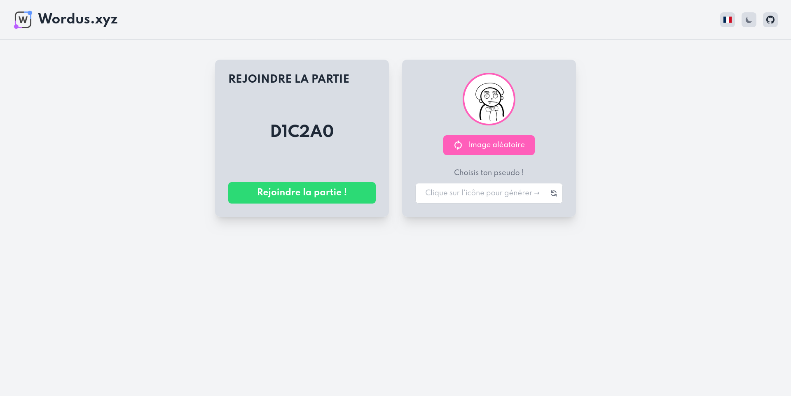
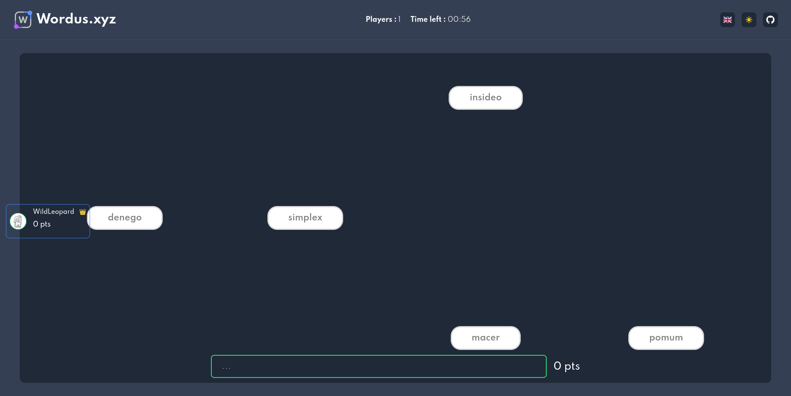
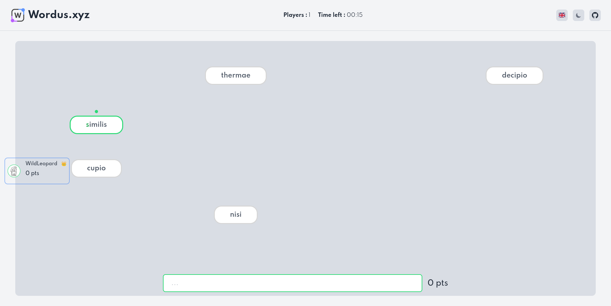
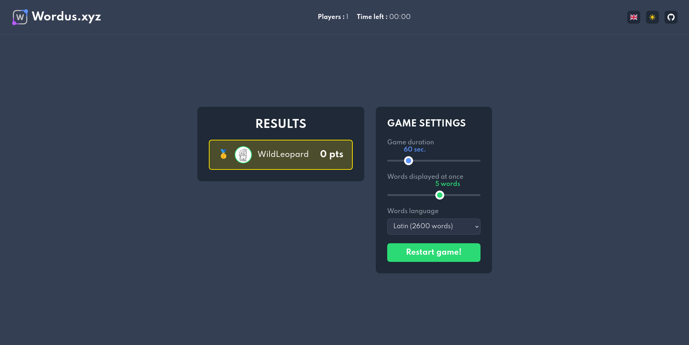
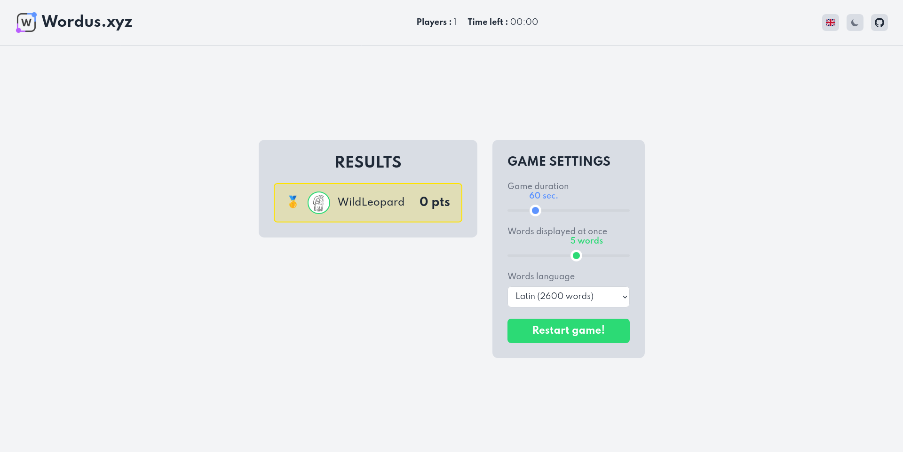

<p align="center">
  
</p>

<p align="center">
  <strong>Jeu de dactylographie multijoueur en temps réel</strong>
</p>

<p align="center">
  <a href="https://wordus.xyz">wordus.xyz</a> •
  <a href="#fonctionnalités">Fonctionnalités</a> •
  <a href="#installation">Installation</a> •
  <a href="#docker">Docker</a> •
  <a href="#contribution">Contribution</a>
</p>

<p align="center">
  
  
  
  
</p>

<p align="center">
  
  
  
  
  
  
</p>

---

## À propos

**Wordus** est un jeu de dactylographie multijoueur où vous affrontez vos amis en temps réel. Créez une partie, partagez le code d'invitation et tapez les mots plus vite que vos adversaires pour grimper au scoreboard !

## Captures d'écran

| Sombre | Clair |
|:------:|:-----:|
|  |  |
|  |  |
|  |  |
|  |  |
|  |  |

## Fonctionnalités

- **Multijoueur temps réel** — Jusqu'à 6 joueurs par partie via WebSocket
- **3 langues de mots** — Français (320k mots), Anglais (68k mots), Latin (2600 mots)
- **Interface bilingue** — Français et Anglais avec détection automatique du navigateur
- **Thème clair/sombre** — Basculez entre les modes avec détection des préférences système
- **Paramètres personnalisables** — Durée (30-180s), nombre de mots affichés (1-8)
- **Avatars personnalisables** — Choisissez votre avatar et pseudo
- **Système de combo** — Enchaînez les mots pour maximiser votre score avec des multiplicateurs

## Stack technique

| Technologie | Usage |
|-------------|-------|
| [Nuxt 4](https://nuxt.com) | Framework Vue.js |
| [Vue 3](https://vuejs.org) | UI réactive |
| [TypeScript](https://www.typescriptlang.org) | Typage statique |
| [Pinia](https://pinia.vuejs.org) | State management |
| [TailwindCSS](https://tailwindcss.com) | Styling |
| [Socket.io](https://socket.io) | WebSockets temps réel |
| [pnpm](https://pnpm.io) | Package manager |

## Installation

### Prérequis

- Node.js 20+
- pnpm

### Développement

```bash
# Cloner le repo
git clone https://github.com/corploc/wordus.git
cd wordus

# Installer les dépendances
pnpm install

# Lancer le serveur de développement
pnpm dev
```

L'application sera disponible sur `http://localhost:3000`

### Build de production

```bash
pnpm build
pnpm preview
```

## Docker

### Build

```bash
docker build -t wordus \
  --build-arg NUXT_UMAMI_WEBSITE_ID=your-id \
  --build-arg NUXT_UMAMI_HOST=https://cloud.umami.is \
  .
```

### Run

```bash
docker run -p 3000:3000 wordus
```

### Image Docker Hub

```bash
docker pull corploc/wordus
docker run -p 3000:3000 corploc/wordus
```

## Configuration

| Variable | Description | Défaut |
|----------|-------------|--------|
| `NUXT_UMAMI_WEBSITE_ID` | ID du site Umami (analytics) | - |
| `NUXT_UMAMI_HOST` | Host Umami | `https://cloud.umami.is` |
| `NUXT_PUBLIC_BASE_URL` | URL de base de l'application (utilisée pour les connexions socket) | `http://localhost:3000` |

## Contribution

Les contributions sont les bienvenues !

1. Fork le projet
2. Créez votre branche (`git checkout -b feature/ma-feature`)
3. Committez vos changements (`git commit -m 'feat: ajout de ma feature'`)
4. Push sur la branche (`git push origin feature/ma-feature`)
5. Ouvrez une Pull Request

### Conventions de commit

Ce projet utilise [Conventional Commits](https://www.conventionalcommits.org/) :

- `feat:` nouvelle fonctionnalité
- `fix:` correction de bug
- `docs:` documentation
- `style:` formatage
- `refactor:` refactoring
- `test:` ajout de tests

## License

MIT © [corploc](https://github.com/corploc)
